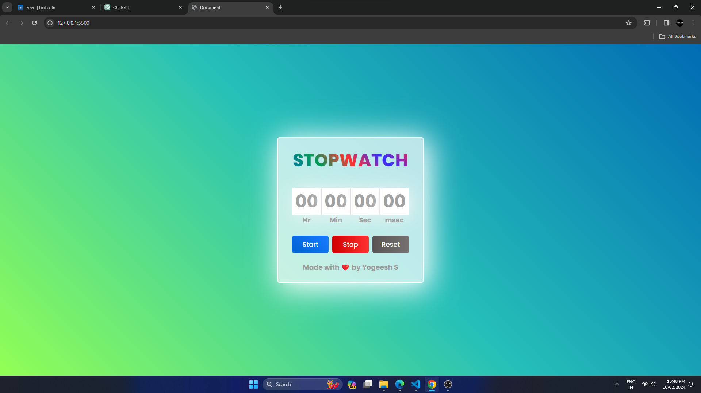

# Stopwatch Project

[](https://opensource.org/licenses/MIT)

A minimalist stopwatch web application built using HTML, CSS, and JavaScript. This project was created as a part of my journey in web development, focusing on enhancing my skills in front-end technologies.

## Preview



## Features

- **Start/Stop Functionality:** Click the "Start" button to initiate the stopwatch, and the "Stop" button to pause it.
- **Reset:** Reset the stopwatch to zero with a single click on the "Reset" button.
- **Clean Design:** The user interface is designed for simplicity and ease of use.

## Demo

Check out the live demo [here](https://yogeesh-s.github.io/stopwatch/).

## Getting Started

1. **Clone the repository:**

```bash
git clone https://github.com/yogeesh-s/stopwatch.git
